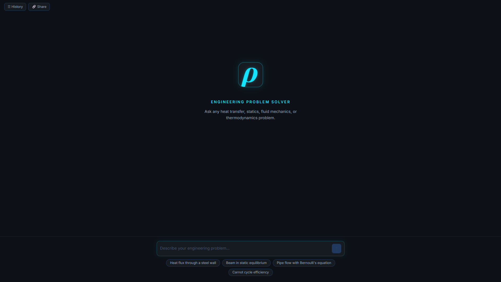
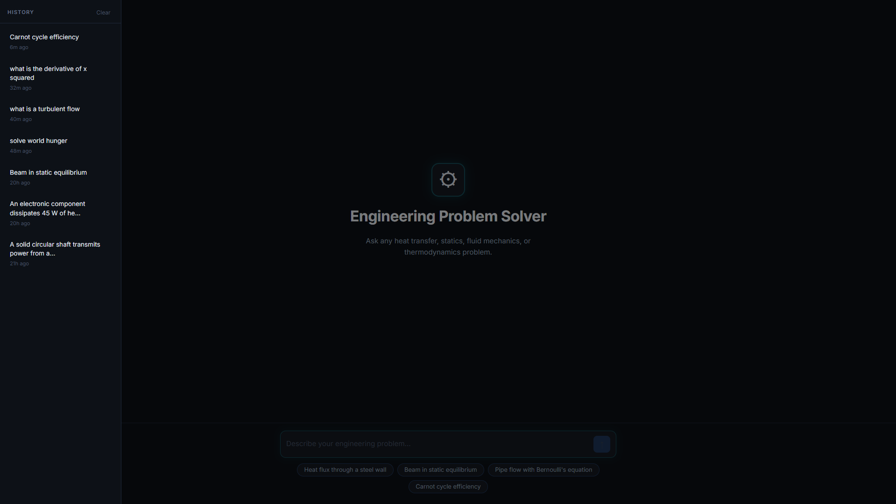
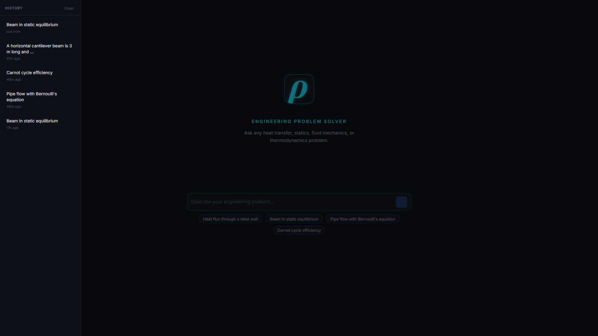

# Rho — Engineering Problem Solver

An AI-powered web app that solves mechanical engineering problems step by step. Describe a problem in plain English and get back a structured solution with formulas, worked calculations, rendered equations, and a physical explanation.

**Live:** [rho-engineering.vercel.app](https://rho-engineering.vercel.app)



---

## Features

- **Structured solutions** — given values, relevant formulas, step-by-step working, final answer, and a physical explanation
- **Equation rendering** — LaTeX equations rendered with KaTeX in every section
- **Chat history** — past solutions saved locally in the browser, with per-entry delete and a clear-all option (no account needed)
- **Resilient to API hiccups** — model fallback chain (2.5 Flash → 2.5 Flash-Lite → 2.5 Pro) with exponential-backoff retries on transient Gemini errors (404/429/503), plus a frontend auto-retry countdown so the user doesn't have to manually click "try again"
- **Out-of-scope handling** — empty / N/A sections are silently skipped so the response stays clean
- **Responsive dark UI** — auto-expanding textarea, neon accents per section, mobile-friendly layout

## Screenshots

A worked Cantilever beam problem:

<p align="center">
  
  
</p>

History side bar: 

<p align="center">
  
</p>

## Supported Topics

- Heat Transfer
- Statics
- Fluid Mechanics
- Thermodynamics
- Dynamics

## How It Works

1. The frontend sends the user's plain-English problem to the backend over a single `POST /solve` endpoint.
2. The backend wraps the problem in a strict system prompt and calls **Gemini 2.5 Flash** with `responseMimeType: application/json`, forcing a structured response.
3. If a model is unavailable (404), rate-limited (429), or overloaded (503), the backend transparently falls back through a chain of models (`gemini-2.5-flash` → `gemini-2.5-flash-lite` → `gemini-2.5-pro`) and retries the chain up to three times with 2s / 5s / 10s backoff. If everything fails, the response carries `retryable: true` and the frontend starts a 20-second auto-retry countdown so the user doesn't have to manually click "try again".
4. The frontend parses the JSON, applies a `roundNumbers()` safety net to enforce 2dp on the final answer, and renders each section as a colored card with KaTeX-rendered math.
5. Successful solutions are stored in `localStorage` so the user can revisit them instantly without spending another API call.

## Tech Stack

| Layer | Technology |
|---|---|
| Frontend | React + Vite |
| Equation Rendering | KaTeX (via `react-katex`) |
| Backend | Node.js + Express |
| AI | Google Gemini 2.5 Flash |
| Frontend Hosting | Vercel |
| Backend Hosting | Render |

## Project Structure

```
rho-engineering-solver/
├── frontend/              # React app
│   └── src/
│       ├── App.jsx
│       └── App.css
├── backend/               # Express API
│   └── src/
│       ├── index.js
│       ├── routes/
│       │   └── solve.js
│       └── services/
│           └── gemini.js
└── docs/
    └── screenshots/
```

## Running Locally

The frontend and backend are separate servers — both need to run.

### Backend

```bash
cd backend
npm install
```

Create a `.env` file in the `backend/` folder:

```
GEMINI_API_KEY=your_api_key_here
PORT=3000
```

Get a free API key at [aistudio.google.com](https://aistudio.google.com).

```bash
npm run dev
```

Server runs at `http://localhost:3000`.

### Frontend

```bash
cd frontend
npm install
npm run dev
```

App runs at `http://localhost:5173`.

> The frontend points to the live Render backend by default. To use your local backend instead, change `API_URL` in `frontend/src/App.jsx` to `http://localhost:3000/solve`.

## API

**POST** `/solve`

Request:
```json
{
  "problem": "A steel plate 10 mm thick with thermal conductivity 50 W/m·K has one side at 200 °C and the other at 50 °C. Find the heat flux."
}
```

Response:
```json
{
  "problem_type": "Heat Transfer",
  "given_values": {
    "Thickness": "10 mm",
    "k": "50 W/m·K",
    "T1": "200 °C",
    "T2": "50 °C"
  },
  "formulas": [
    { "description": "Fourier's Law of Conduction", "latex": "q = -k \\frac{dT}{dx}" }
  ],
  "steps": [
    { "step_number": 1, "description": "Compute the temperature gradient across the plate.", "latex": "\\frac{dT}{dx} = \\frac{T_2 - T_1}{L} = \\frac{50 - 200}{0.01} = -15000 \\text{ K/m}" },
    { "step_number": 2, "description": "Apply Fourier's Law to find the heat flux.", "latex": "q = -k \\frac{dT}{dx} = -50 \\times (-15000) = 750000 \\text{ W/m}^2" }
  ],
  "final_answer": {
    "value": "750000",
    "units": "W/m²",
    "latex": "q = 750000 \\text{ W/m}^2"
  },
  "physical_explanation": "..."
}
```

## Notes & Limitations

- The deployed backend uses Gemini's free tier, so high-demand 503 errors do happen during peak hours despite the retry logic. Trying again a moment later usually succeeds.
- Solutions are AI-generated and best treated as a study aid — sanity-check the formulas and numerical answers against your own work before relying on them.
- The app is targeted at undergraduate-level mechanical engineering problems. Out-of-scope questions (e.g. "solve world hunger") are detected and answered with just a Physical Explanation note.
- Chat history is stored in `localStorage` only — it is not synced across devices and clearing browser data wipes it.
